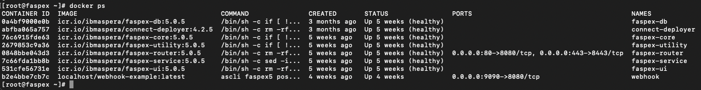
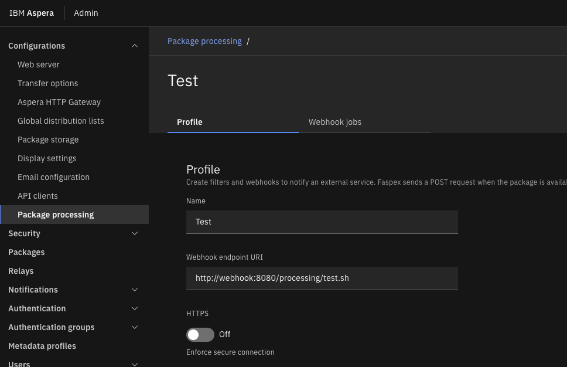

# Migrating Post-Processing Scripts to Faspex 5

## Introduction

This repository provides instructions and assets showing how to migrate post-processing scripts from Faspex 4 to 5.

In Faspex 4, post-processing scripts could be added that would run after a package was recieved.  This feature was removed in Faspex 5, and replaced with the ability to invoke a script via web-hook - in other words, the URL of a server hosting a script is specified which will be called with details of the package.

### Hosting the script
For convenience, the ascli command in Faspex 5 includes a feature that provides this webhook server facility.  When run in this mode, it listens for a connection and then invokes a script.  The details regarding the package, including its file location, are passed to the script in the body of the HTTP request.

### Faspex 5 architecture

Faspex 5 is deployed in a series of containers.  To continue this design principle, these instructions describe how to create a container that runs the ascli post-processing webhook server.  The script therefore runs inside a container which does have consequences when migrating scripts; the webhook container has its own filesystem which is segregated from that of the HSTS node to which the package files are uploaded.  It is necessary to run the webhook server in a container, because the UI container needs to be able to access it via the docker network.

For example, if a Faspex 4 post-processing script would copy a recieved file from a package using ascp to a remote location, this script would run on the same machine on which the packages were received and could therefore access the files directly.  But in Faspex 5, both the script are running inside containers, and even if the HSTS is on the same machine it is effectively a remote node as far as the containers are concerned.  To then copy the file between two HSTS severs we can use ascli to instruct the first server to upload the file to the second server using ssh.

### Pre-requisites

Clone this repository to a suitable working directory on the Faspex server e.g. your home directory

Faspex 5 should be installed and configured with an HSTS node.  It is vital to follow the instructions for [configuring an HSTS node for Faspex]([https://www.ibm.com/docs/en/aspera-faspex/5.0.6?topic=storage-configuring-linux-node-faspex](https://www.ibm.com/docs/en/aspera-faspex/5.0?topic=storage-configuring-linux-node-faspex)).  These instructions set up a Node API user, and for the container method we will need the HTTP URL, the node username and the associated password to run the scripts.  The ascli command we will use relies on the Node API.

## Instructions to install the sample

### Webhook Container

On the Faspex machine navigate to the directory where you cloned this repository.  Run the command:

    ./build.sh

This will build a container using the docker commands that are already installed in Faspex 5.

Examine the file `run.sh`:

    docker run --name webhook \
        -v ./scripts:/scripts \
        -v ./keys:/keys \
        -p 9090:8080 \
        --network="faspex_container_network" \
        webhook-example

- The second line mounts the `scripts` directory from this repository into the container. This directory contains an example script we will edit later.
- The third line mounts the `keys` directory into the container. **This directory must contain the 
private key for the identity that will be used to connect to the target directory for this file transfer.**  

Now run the command:

    ./run.sh

To verify that the container has started, run the following command:

    docker ps

The list of containers should contain one called `webhook` as shown below

### Migrate Scripts

As mentioned above, the webhook script runs in a container and in this example it has to initiate a transfer between two remote HSTS nodes.  The `ascli` command supports this.  It contacts the source server using the Node API (that we configured during Faspex 5 installation as described above) and instructs that server to push a file to the destination server using ssh.

In this example we have `test-script.sh` which demonstrates how this works.  The propeties for the transfer are at the top of the file:

- PRIVATE_KEY is the name of the key you placed in the `keys` folder
- SOURCE_ROOT is populated from the request body and referred to by its bash variable name
- DEST_ROOT is the destination of the file. In this case, because we are using ascp/SSH to transfer the file, this location is an absolute path
- SOURCE_HOST is the file from which you are uploading the file - this is the same host that Faspex is connected to where packages will be hosted
- DEST_HOST is the destination host URL which uses the ssh:// scheme
- DEST_USERNAME is the user associated with the private key
- SOURCE_USERNAME is the **node api user* that was created during the installation instructions, specifically the part about configuring a node for Faspex which was mentioned earlier.
- SOURCE_PASSWORD is the password for the same
- TARGET_RATE is the target transfer rate.

Once these are configured in `scripts/test-script.sh` this should be sufficient.  For a detailed explanation of ascli, see the [ascli documentation on GitHub](https://github.com/IBM/aspera-cli_).\

### Confugre Faspex

The `listener-config.json` file configures the webhook listener. In this example it listens on port 8080 and at the path /processing.  The core engine that will call the script is running in a container and is therefore on the docker network.  Containers on the docker network have hostnames equivalent to the container names. Therefore, in the package processing page in the Admin portal we need to instruct Faspex to invoke the following URL:

    http://webhook:8080/processing/test-script.sh

The package settings page should look as follows:

### Test

Once this is done, the files from the package should be transferred to the second remote host.  To view the logs from the webhook process, run the following command:

    docker logs -f webhook

